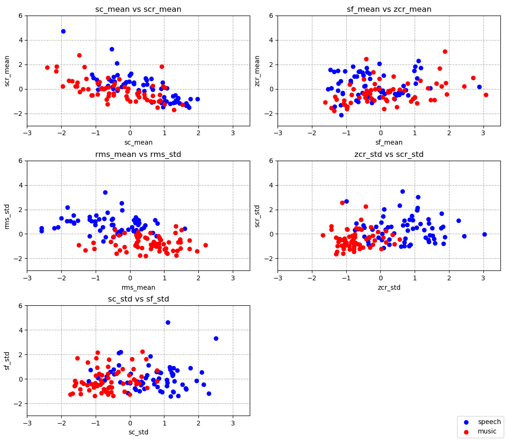

# MUSI_6201-Assignment2

#### C2

The rms mean and std features provide the best seperation between the speech and music. We can clearly draw a boundary that mostly seperates the classes.

The sf_std vs sc_std and scr_std vs zcr_std gives some seperation. But it would be hard to classify just with them as we can see, there are a lot of overlapping datapoints and it is hard to clearly draw a seperating boundary.

We dont think scr_mean vs sc_mean and sf_mean vs zcr_mean are good features pairs when used alone as they dont distinguish the data points so well.